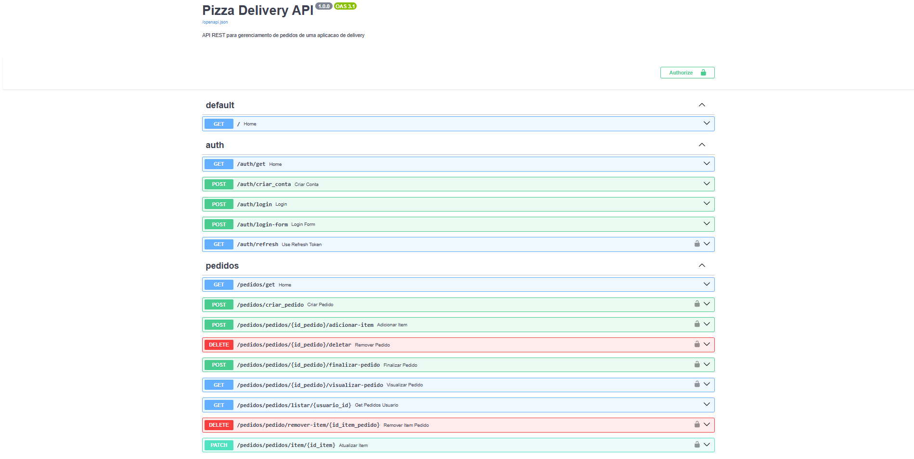

# Pizza Delivery API 🍕

A REST API for managing pizza orders, built as a personal project to practice backend development concepts using FastAPI.

This project focuses on understanding how a real backend API works, from project structure to authentication and database versioning.

## API Overview

## 🚀 Tech Stack
- Python
- FastAPI
- SQLAlchemy
- Alembic
- JWT
- OAuth2
- SQLite (can be replaced with another database)

## 📌 Features
- User registration
- User authentication with JWT
- Login using OAuth2 (Swagger authorization)
- Create pizza orders
- Protected routes
- Automatic API documentation with Swagger/OpenAPI

## ⚙️ How to run the project

1. Clone the repository  
2. Create and activate a virtual environment  
3. Install dependencies:

pip install -r requirements.txt

Run database migrations:

- alembic upgrade head

Start the application:

uvicorn main:app --reload

📖 API Documentation

After running the project, access:

http://127.0.0.1:8000/docs

🔐 Authentication

This API uses JWT authentication with OAuth2.

You can log in using the authentication route and authorize directly in Swagger to access protected endpoints.

🛠️ Project Status

🚧 Work in progress 🚧
New features and improvements are being added continuously.

💡 Author

Eduardo